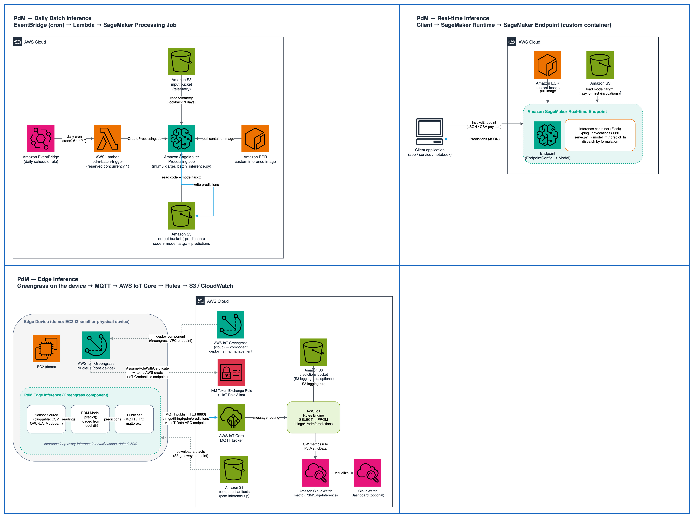

# Predictive Maintenance Skill

An AI agent skill that generates complete predictive maintenance (PdM) models end-to-end: from raw IoT sensor data in S3 to a deployed SageMaker inference endpoint, daily batch job, or edge device via AWS IoT Greengrass.

> 📝 **Blog post:** [Building Predictive Maintenance Models from raw IoT data with Kiro and Amazon SageMaker](https://builder.aws.com/content/3DkXbcQxyPux7nYBREEBUW3W08F/building-predictive-maintenance-models-from-raw-iot-data-with-kiro-and-amazon-sagemaker) — a walkthrough of this project.

## What It Does

Give your AI Coding Assistant access to your S3 data and ask it to build a failure prediction model. The skill guides the agent through a nine-phase workflow:

1. **Setup** — project scaffolding, dependencies
2. **Data Exploration** — discover schemas, joins, formulation strategy
3. **Raw Aggregation** — load, join, label, temporal split
4. **Baselines** — first working model per formulation
5. **Experimentation** — hypothesis-driven feature engineering loop
6. **Save & Plan** — artifacts to S3, post-training decisions
7. **Example Inference** — score one day of data for validation
8. **Deploy** — real-time endpoint, daily batch, and/or edge device (Greengrass)
9. **Documentation** — auto-generated project README

## Supported Formulations

| Formulation | Use When |
|---|---|
| **RUL Regression** | You have run-to-failure data and need precise remaining-life estimates |
| **Failure Classification** | You have failure labels and need binary/multi-label alerts |
| **Survival Analysis** | Devices are maintained before failure (censored data) |
| **Anomaly Detection** | You want unsupervised deviation detection without failure labels |

## Deployment Options

| Mode | Infrastructure | Use When |
|------|---------------|----------|
| **Real-time endpoint** (8A) | SageMaker endpoint | Low-latency API calls, fleet-wide scoring |
| **Batch inference** (8B) | EventBridge + Lambda + SageMaker Processing | Daily scheduled scoring, cost-efficient |
| **Edge deployment** (8C) | IoT Greengrass + EC2/physical device | On-device inference, offline-capable, bandwidth-constrained |

### Edge Deployment (Phase 8C)

Deploy the trained model to edge devices using AWS IoT Greengrass. The model runs inference locally on sensor data and publishes only predictions (not raw data) to AWS IoT Core via MQTT. The edge component uses a pluggable sensor source interface — ships with CSV replay for demos; implement custom sources for OPC-UA, MQTT, Modbus, or any industrial protocol.

```bash
# Deploy infrastructure (EC2 + IoT Core + Greengrass)
cd infrastructure/edge && cdk deploy

# Build, publish, and deploy the Greengrass component
bash scripts/deploy_edge.sh --model-dir ./fault_prediction/baseline/model

# Teardown when done
bash scripts/deploy_edge.sh --destroy
```

See `edge_component/README.md` for the sensor source interface and `infrastructure/edge/README.md` for CloudWatch metric configuration per formulation.

## Architecture

The three deployment modes at a glance — daily batch inference (EventBridge → Lambda → SageMaker Processing Job), a real-time SageMaker endpoint, and edge inference on AWS IoT Greengrass publishing to IoT Core:



## Benchmark Results

Results from running the full skill workflow (Phases 1–5: setup → data prep → baseline → experimentation) on four canonical PdM benchmarks.

**Best results** (after Phase 5 experimentation loop with feature engineering):

| Benchmark | Metric | Best Result | Published SOTA | Notes |
|-----------|--------|-------------|----------------|-------|
| C-MAPSS FD001 (RUL) | RMSE ↓ | **11.40** | 9.21 (AutoRUL) | +24% gap; feature selection + XGBoost HPO |
| AI4I 2020 (Classification) | F1 ↑ | **0.889** | ~0.99 (FL+SMOTE) | -10% gap; closes with SMOTE |
| Backblaze hdfail (Survival) | C-index ↑ | **0.88** | 0.958 (Cox, 21 feats) | 52K drives, 94% censoring |
| NASA SMAP (Anomaly Detection) | F1 ↑ | **0.97** | ~0.90 (THOC/TranAD) | Spectral Residual; **exceeds SOTA** |

**Baselines** (Phase 4 only — no experimentation, default model, no feature engineering):

| Benchmark | Metric | Baseline | Notes |
|-----------|--------|----------|-------|
| C-MAPSS FD001 (RUL) | RMSE ↓ | 16.48 | `RULPredictor(window_size=15, stride=5, presets=medium_quality)` |
| AI4I 2020 (Classification) | F1 ↑ | 0.82 | `FailureClassifier()` with default features |
| Backblaze hdfail (Survival) | C-index ↑ | 0.88 | `SurvivalPredictor()` — 52K drives, 94% censoring |
| NASA SMAP (Anomaly Detection) | F1 ↑ | 0.97 | `SpectralResidualDetector(sr_window=5, aggregation_percentile=95)` |

The baselines in `pdm/benchmarks/baselines.json` are regression gates — they ensure code changes don't degrade the out-of-the-box model quality. The "Best Result" column reflects what the skill achieves when the full experimentation loop (Phase 5) runs with domain-informed feature engineering.

The library achieves competitive results with minimal configuration. The RUL gap is primarily a model diversity issue (AutoRUL searches over SVR/KNN in addition to tree ensembles). The classification gap closes with SMOTE and threshold tuning. The anomaly detection F1 improved from 0.73 to 0.97 (+33%) by switching from temporal PCA reconstruction (`TemporalAnomalyDetector`) to Spectral Residual frequency-domain analysis (`SpectralResidualDetector`). The SR method computes per-feature FFT saliency, z-scores against training distribution, and aggregates using a robust percentile — achieving results that exceed published SOTA on SMAP without requiring deep learning or GPU.

## Installation

### Quick Install (git clone)

```bash
git clone git@github.com:aws-samples/sample-predictive-maintenance-skill.git ~/.kiro/skills/predictive-maintenance
```

### Manual

Copy this folder into your Kiro skills directory:
- **Global** (all projects): `~/.kiro/skills/predictive-maintenance/`
- **Workspace** (one project): `.kiro/skills/predictive-maintenance/`

## Optional: Knowledge Acquisition Skill

The predictive-maintenance skill can leverage the **knowledge-acquisition** skill to build a domain-specific research wiki before running experiments. This is used in **Phase 5 (Experimentation)** — specifically Step 0: "Build Domain Knowledge Base" — where the agent researches state-of-the-art techniques from academic literature (arXiv, Semantic Scholar, Papers With Code, etc.) to ground experiments in proven methods rather than ad-hoc intuition.

The wiki produces actionable hypotheses for feature engineering and model selection, tailored to the specific PdM formulation (RUL, classification, survival, anomaly detection). Experiments that draw from literature-backed techniques consistently outperform those based on intuition alone.

### Install

```bash
git clone https://github.com/aws-samples/sample-knowledge-acquisition-skill.git ~/.kiro/skills/knowledge-acquisition
```

Or for workspace-scoped installation:

```bash
git clone https://github.com/aws-samples/sample-knowledge-acquisition-skill.git .kiro/skills/knowledge-acquisition
```

### What It Does During Experimentation

When the experimentation phase begins, the agent uses the knowledge-acquisition skill to:

1. **Gather sources** — searches arXiv, Semantic Scholar, OpenAlex, and Papers With Code for papers relevant to the formulation (e.g., "remaining useful life prediction", "unsupervised anomaly detection IoT")
2. **Distill findings** — extracts key techniques, feature engineering strategies, and model architectures
3. **Write wiki pages** under `./wiki/concepts/`:
   - `feature-engineering-pdm.md` — state-of-the-art feature engineering for the formulation
   - `<formulation>-techniques.md` — best models, loss functions, evaluation metrics
   - `domain-features.md` — domain-specific features for the equipment type
4. **Generate experiment hypotheses** — each wiki page ends with an "Implications for Experiments" section listing concrete, actionable ideas

Without this skill installed, the experimentation phase still works — the agent will propose experiments based on feature importance analysis and CAAFE-style semantic reasoning. The knowledge-acquisition skill adds literature grounding that improves experiment quality.

## Requirements

- **Python 3.11+** with `uv` (or pip)
- **AWS credentials** with S3 read access + SageMaker (for deployment)
- **Kiro CLI**, or **Kiro IDE**, or **Claude Code**

Key Python dependencies (installed automatically by `scripts/setup.sh`):
- `autogluon.tabular` — AutoML training
- `boto3` / `pyarrow` — S3 + Parquet I/O
- `pandas` / `numpy` / `scikit-learn` — data processing
- `lifelines` — survival analysis
- `flask` — inference container

## Usage

Start your AI Coding Assistant and say:

```
Build a predictive maintenance model from my S3 data in s3://my-bucket/
```

Or for benchmark datasets:

```
Train a RUL model on the C-MAPSS dataset
```

The skill activates automatically based on keywords like "predictive maintenance", "failure prediction", "remaining useful life", "RUL", or "survival analysis".

## Project Structure

```
predictive-maintenance/
├── SKILL.md                    # Agent instructions (9-phase workflow)
├── README.md                   # This file
├── docs/                       # Diagrams & static assets for docs
│   └── architecture-overview.png
├── references/                 # Detailed phase guides (loaded on demand)
│   ├── data-exploration.md
│   ├── benchmark-datasets.md
│   ├── raw-aggregation.md
│   ├── baselines.md
│   ├── experimentation.md
│   ├── artifacts.md
│   ├── deployment.md
│   └── readme-template.md
├── scripts/                    # Setup & utilities
│   ├── setup.sh                # One-command project bootstrap
│   ├── save_model.sh           # Upload artifacts to S3
│   └── pyproject.toml          # Dependencies
├── pdm/                        # Standalone PdM library (usable without the skill)
│   ├── README.md               # Library documentation
│   ├── data/                   # S3 exploration, EAV aggregation, feature utils
│   ├── anomaly_detection/      # Spectral Residual + Temporal PCA + Isolation Forest
│   ├── fault_prediction/       # AutoGluon classification + RUL
│   ├── rul/                    # Sliding-window RUL regression
│   ├── survival/               # Cox PH, Weibull AFT, Random Survival Forest
│   ├── deployment/             # Batch inference + SageMaker handlers
│   └── remote/                 # SageMaker Training Job submission
├── edge_component/             # Greengrass edge inference component
│   ├── README.md               # Usage + custom sensor source guide
│   ├── main.py                 # Inference loop (pluggable sensor sources)
│   ├── sensor_sources/         # SensorSource ABC + CsvReplaySource
│   ├── recipe.yaml             # Greengrass component recipe
│   └── gdk-config.json         # GDK build configuration
├── sagemaker_container/        # Custom Docker container for endpoints
│   ├── README.md
│   ├── Dockerfile
│   ├── serve.py
│   └── inference.py
└── infrastructure/             # CDK stacks (independent apps per deployment mode)
    ├── batch/                  # Phase 8B: EventBridge + Lambda + SageMaker
    └── edge/                   # Phase 8C: IoT Core + Greengrass + EC2
```

## The `pdm/` Library

The `pdm/` directory is a standalone Python library usable independently of the AI Coding Assistant skill. It provides:

- **5 model classes**: `AnomalyDetector`, `TemporalAnomalyDetector`, `SpectralResidualDetector`, `FailureClassifier`, `RULPredictor`, `SurvivalPredictor`
- **CLI tools** for training, evaluation, and inference
- **S3 utilities** for exploring and loading partitioned parquet data
- **Batch inference** utilities for production scheduling

See [`pdm/README.md`](pdm/README.md) for full API documentation and usage.

## How It Works

Your AI Coding Assistant loads skills through **progressive disclosure**:

1. At startup, only the `name` and `description` from `SKILL.md` frontmatter are loaded (minimal context cost)
2. When your request matches the skill description, the full `SKILL.md` instructions load
3. The agent reads `references/` files only when needed for the current phase

This means the skill has near-zero overhead when not activated.

## Compatibility

This skill follows the open [Agent Skills](https://agentskills.io) standard and works with:

- **Kiro CLI**, **Kiro IDE**, or **Claude Code**
- Any agent that supports the Agent Skills `SKILL.md` format

## Security

See [CONTRIBUTING](CONTRIBUTING.md#security-issue-notifications) for more information.

## License

This library is licensed under the MIT-0 License. See the LICENSE file.
